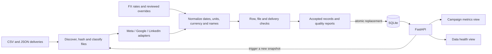

# Campaign Data Hub

A small full-stack system that turns three advertising export formats into one traceable campaign dataset and reports the quality of every weekly delivery.

The implementation favors code that can be read and explained in one sitting: platform adapters translate source fields, ordinary Python functions normalize and check rows, SQLite stores one atomic snapshot, FastAPI exposes it, and two React views make metrics and data health visible.

## Quick start with Docker

With Docker Desktop running, build, ingest, and start the complete application with one command:

```bash
docker compose up --build
```

Open <http://127.0.0.1:8000>. Stop it with `docker compose down`; the named SQLite volume is retained.

## Local development

Prerequisites: Python 3.12+, [uv](https://docs.astral.sh/uv/), Node.js 20.19+ and npm.

```bash
make setup
make ingest
make run
```

Open <http://127.0.0.1:8000>. FastAPI's interactive API documentation is at <http://127.0.0.1:8000/docs>.

`make ingest` is safe to repeat. It recalculates the snapshot and replaces the current rows in one transaction, so the second run produces the same fingerprint, counts, metric rows, and quality reports.

To run the backend and frontend separately during development:

```bash
# terminal 1
make dev-api

# terminal 2
make dev-web
```

The Vite development server is available at <http://127.0.0.1:5173> and proxies `/api` to FastAPI.

Run every automated check with:

```bash
make check
```

## Architecture



The ingestion path is synchronous because the supplied corpus is 15 small files. It builds the complete result in memory before opening the write transaction. A file or row defect becomes structured evidence and processing continues. An unexpected configuration or persistence error does not replace the previously committed snapshot.

SQLite is enough for a single-process assessment application and makes a fresh clone easy to run. The schema still has foreign keys, check constraints and uniqueness rules, so moving to PostgreSQL later would not require redesigning the data model. One ingestion lock makes the single-worker boundary explicit.

## Data model

The database contains three tables:

- `deliveries` stores each physical file or expected-but-missing slot, its hash, raw bytes, status, health and row counts.
- `metric_records` stores canonical daily records plus the source locator, original row and applied transformation rules.
- `check_results` stores named check outcomes, counts and detailed JSON findings.

Money is stored as integer millionths of a US dollar. This preserves the supplied Google micro-unit amounts and the fixed currency conversions without binary floating-point drift. Unknown values remain `NULL`; they are not turned into zero. CTR and CPC use only rows where both parts of the ratio are known, and the API returns that calculation basis.

USD remains the canonical reporting value. The dashboard can display USD or EUR using the finance-provided rates stored with the ingested snapshot. Because the source configuration defines one unit of currency as a USD value, the presentation conversion is `canonical USD / rate`. Changing the display currency never rewrites stored metrics or their source evidence.

For one displayed number, the UI can open its source records. Each record links to a delivery, filename, content hash and line/index locator, while showing the raw values and the transformations that produced the canonical values.

The interface uses Digitalzone's public logo, Futura PT headings, Roboto body text and its navy/violet/blue palette. The platform selector and popovers use Radix primitives, and the date range uses DayPicker. This follows the same composition model as shadcn components while keeping the existing Vite application and a small CSS layer instead of adding Tailwind solely for the component generator. The UI remains usable when hosted without the web fonts because each font stack has local fallbacks.

Campaign metrics have platform, campaign, date-range and display-currency controls. Data health has a capped notification menu, a visible ingestion pipeline, file/ID search, platform and health filters, a date range, and an eight-week paginated delivery-coverage grid. These controls are data-driven and do not assume that the input belongs to a particular month.

## API

| Method | Path | Purpose |
|---|---|---|
| `POST` | `/api/ingestion` | Build and atomically publish the current snapshot |
| `GET` | `/api/metrics` | Totals and metrics grouped by campaign or platform |
| `GET` | `/api/records` | Source-level trace for a metric selection |
| `GET` | `/api/deliveries` | Delivery list, filters and health counts |
| `GET` | `/api/deliveries/{id}` | One delivery with every check and finding |
| `GET` | `/api/health` | Database connectivity check |

`/api/metrics` accepts `platform`, `campaign`, `start_date`, `end_date`, and `group_by`. Campaign matching is case-insensitive and applies to rows, totals and source trace results. Dates require `YYYY-MM-DD`, reversed ranges and unknown parameters return `422`, missing resources return `404`, stale trace requests and concurrent ingestion return `409`.

## Quality policy

Checks are registered by name and return the same `CheckResult` shape. Adding a delivery-level rule means writing one function and adding it to `DELIVERY_CHECKS`; parsing, persistence and API code do not change.

The implemented checks cover:

- filename, extension, expected reporting week and parse/schema validity;
- duplicate delivery content and conflicting files for one platform/week;
- campaign identity, date validity, date convention and LinkedIn timestamp convention;
- missing metrics, numeric ranges, supported currency and exact money precision;
- exact/equivalent duplicate rows and conflicting campaign/day rows;
- campaign/day completeness, suspicious spend units, weekly volume and delivery cadence.

An error-level finding or a crashed check produces **fail**. Warning-only findings produce **warn**. A delivery with neither produces **pass**. Informational findings document accepted variations and transformations without reducing health.

The supplied data produces 16 reports: 15 physical files plus one missing delivery. The result is 8 pass, 4 warn and 4 fail, with 368 accepted rows, 8 duplicate rows, 1 rejected row and 35 corrected rows. The detailed evidence is in [docs/DATA_QUALITY.md](docs/DATA_QUALITY.md).

## Important interpretation

The Meta delivery for 2026-06-08 has spend values roughly 100 times the other Meta weeks and every value is an integer. I treat that as cents mislabeled as dollars. Because an automatic guess would silently change business data, the correction is approved only for the exact file SHA-256 in `config/normalization_overrides.json`. All 35 rows retain the before/after rule, and the delivery remains failed to make the source-contract breach visible.

Campaign names are the only available identity. The canonical key is `(platform, trimmed case-folded name)`, and the most common source spelling is used for display. Real platform campaign IDs would be preferable if the exports contained them.

## Project map

```text
backend/app/adapters/     source-format translation only
backend/app/normalization.py
                          canonical validation and conversion rules
backend/app/checks.py     delivery checks and duplicate-key resolution
backend/app/ingestion.py  deterministic pipeline orchestration
backend/app/database.py   schema and atomic snapshot publication
backend/app/metrics.py    one aggregation path for rows and totals
backend/app/main.py       API routes and ingestion lock
frontend/src/views/      metrics and data-health screens
frontend/src/components/ shared filters, statuses and trace details
frontend/public/platforms/ supplied advertising-platform artwork
config/                  reviewed data-policy overrides
docs/                    assessment, design plan and findings
```

## Trade-offs and next steps

The current database represents the latest view of the source directory. A production system should retain ingestion runs and file revisions, separate validation from promotion, and expose the last trusted snapshot while a new run is reviewed. For larger files, I would stream to staging tables and move ingestion to a durable job queue with request IDs rather than hold the complete result in memory.

The reporting month and expected platforms are intentionally explicit for this assessment. The next useful change is a validated reporting configuration, followed by real campaign IDs, an approval workflow for corrections, authentication, pagination, observability, and a browser-level regression test. I would add cloud storage and queueing only when delivery volume, retries, or multiple workers require them.

The full implementation reasoning and schema are recorded in [docs/IMPLEMENTATION_PLAN.md](docs/IMPLEMENTATION_PLAN.md). The original task is preserved in [docs/ASSESSMENT.md](docs/ASSESSMENT.md).

For interview preparation, follow [docs/CODEBASE_GUIDE.md](docs/CODEBASE_GUIDE.md). The final repository and public-host checklist is in [docs/SUBMISSION_AND_DEPLOYMENT.md](docs/SUBMISSION_AND_DEPLOYMENT.md).
