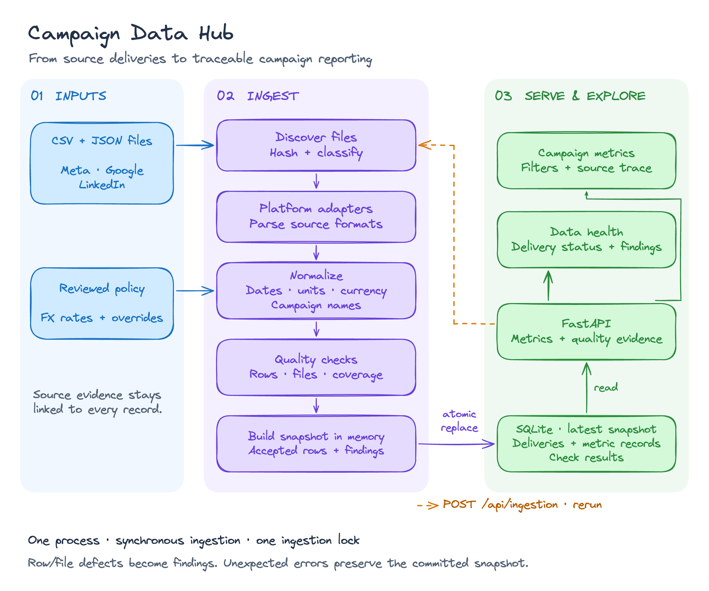
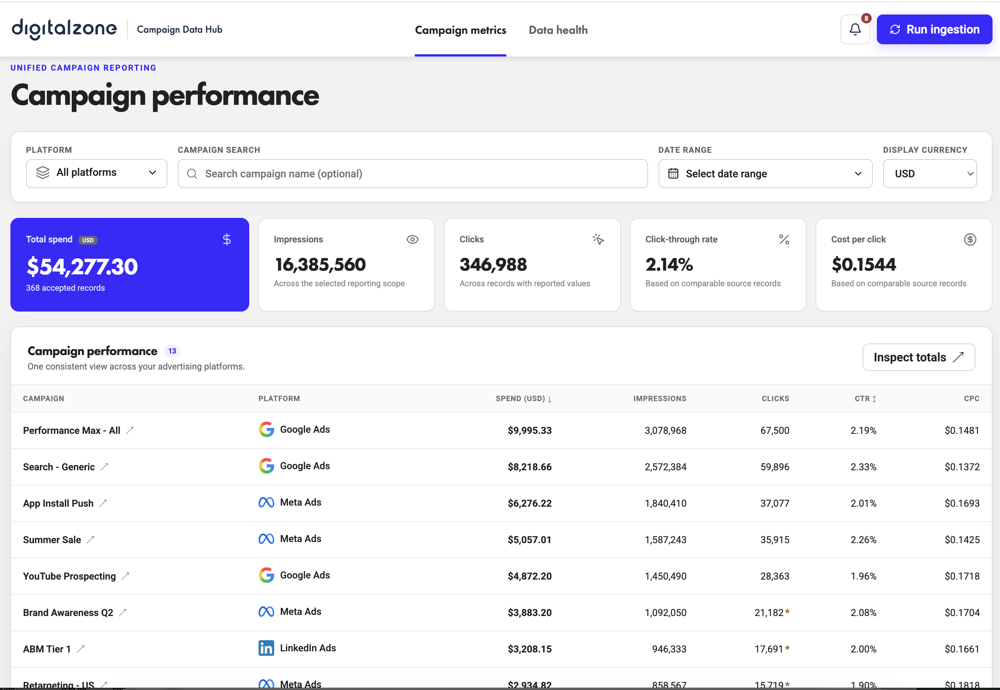
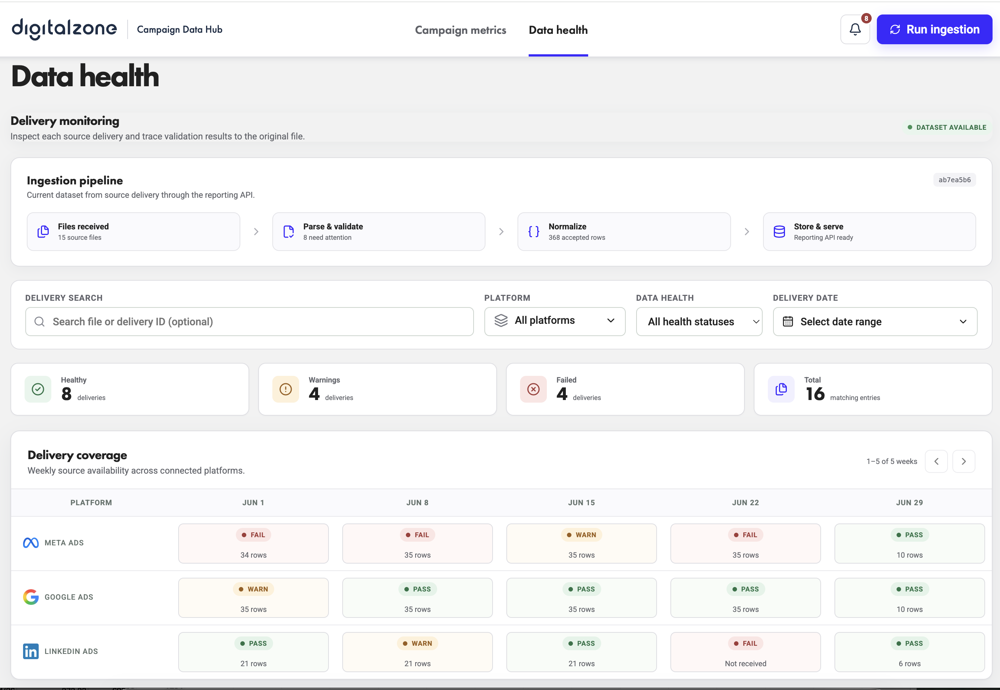

# Campaign Data Hub

## Quick start with Docker

With Docker Desktop running, build, ingest, and start the complete application with one command:

```bash
docker compose up --build
```

Open <http://127.0.0.1:8000>. Stop it with `docker compose down`; the named SQLite volume is retained.

## Local development

Prerequisites: Python 3.12+, [uv](https://docs.astral.sh/uv/), Node.js 20.19+ and npm.

```bash
make setup
make ingest
make run
```

Open <http://127.0.0.1:8000>. FastAPI's API documentation is at <http://127.0.0.1:8000/docs>.

`make ingest` is safe to repeat. It recalculates the snapshot and replaces the current rows in one transaction, so the second run produces the same fingerprint, counts, metric rows, and quality reports.

To run the backend and frontend separately during development:

```bash
# terminal 1
make dev-api

# terminal 2
make dev-web
```

The Vite development server is available at <http://127.0.0.1:5173> and proxies `/api` to FastAPI.

Run every automated check with:

```bash
make check
```

## Architecture



[Editable Excalidraw diagram](assets/architecture.excalidraw) · [SVG version](assets/architecture.svg)

## Application screenshots

### Campaign performance



### Data health



## Data model

The database contains three tables:

- `deliveries` stores each physical file or expected-but-missing slot, its hash, raw bytes, status, health and row counts.
- `metric_records` stores canonical daily records plus the source locator, original row and applied transformation rules.
- `check_results` stores named check outcomes, counts and detailed JSON findings.

Money is stored as integer millionths of a US dollar. This preserves the supplied Google micro-unit amounts and the fixed currency conversions without binary floating-point drift. Unknown values remain `NULL`; they are not turned into zero. CTR and CPC use only rows where both parts of the ratio are known, and the API returns that calculation basis.

USD remains the canonical reporting value. The dashboard can display USD or EUR using the finance-provided rates stored with the ingested snapshot. Because the source configuration defines one unit of currency as a USD value, the presentation conversion is `canonical USD / rate`. Changing the display currency never rewrites stored metrics or their source evidence.

For one displayed number, the UI can open its source records. Each record links to a delivery, filename, content hash and line/index locator, while showing the raw values and the transformations that produced the canonical values.


Campaign metrics have platform, campaign, date-range and display-currency controls. Data health has a capped notification menu, a visible ingestion pipeline, file/ID search, platform and health filters, a date range, and an eight-week paginated delivery-coverage grid. These controls are data-driven and do not assume that the input belongs to a particular month.

## API

| Method | Path | Purpose |
|---|---|---|
| `POST` | `/api/ingestion` | Build and atomically publish the current snapshot |
| `GET` | `/api/metrics` | Totals and metrics grouped by campaign or platform |
| `GET` | `/api/records` | Source-level trace for a metric selection |
| `GET` | `/api/deliveries` | Delivery list, filters and health counts |
| `GET` | `/api/deliveries/{id}` | One delivery with every check and finding |
| `GET` | `/api/health` | Database connectivity check |

`/api/metrics` accepts `platform`, `campaign`, `start_date`, `end_date`, and `group_by`. Campaign matching is case-insensitive and applies to rows, totals and source trace results. Dates require `YYYY-MM-DD`, reversed ranges and unknown parameters return `422`, missing resources return `404`, stale trace requests and concurrent ingestion return `409`.

## Quality policy

Checks are registered by name and return the same `CheckResult` shape. Adding a delivery-level rule means writing one function and adding it to `DELIVERY_CHECKS`; parsing, persistence and API code do not change.

The implemented checks cover:

- filename, extension, expected reporting week and parse/schema validity;
- duplicate delivery content and conflicting files for one platform/week;
- campaign identity, date validity, date convention and LinkedIn timestamp convention;
- missing metrics, numeric ranges, supported currency and exact money precision;
- exact/equivalent duplicate rows and conflicting campaign/day rows;
- campaign/day completeness, suspicious spend units, weekly volume and delivery cadence.

An error-level finding or a crashed check produces **fail**. Warning-only findings produce **warn**. A delivery with neither produces **pass**. Informational findings document accepted variations and transformations without reducing health.

The supplied data produces 16 reports: 15 physical files plus one missing delivery. The result is 8 pass, 4 warn and 4 fail, with 368 accepted rows, 8 duplicate rows, 1 rejected row and 35 corrected rows. The detailed evidence is in [docs/DATA_QUALITY.md](DATA_QUALITY.md).

## Important interpretation

The Meta delivery for 2026-06-08 has spend values roughly 100 times the other Meta weeks and every value is an integer. I treat that as cents mislabeled as dollars. Because an automatic guess would silently change business data, the correction is approved only for the exact file SHA-256 in `config/normalization_overrides.json`. All 35 rows retain the before/after rule, and the delivery remains failed to make the source-contract breach visible.

Campaign names are the only available identity. The canonical key is `(platform, trimmed case-folded name)`, and the most common source spelling is used for display. Real platform campaign IDs would be preferable if the exports contained them.

## Project map

```text
backend/app/adapters/     source-format translation only
backend/app/normalization.py
                          canonical validation and conversion rules
backend/app/checks.py     delivery checks and duplicate-key resolution
backend/app/ingestion.py  deterministic pipeline orchestration
backend/app/database.py   schema and atomic snapshot publication
backend/app/metrics.py    one aggregation path for rows and totals
backend/app/main.py       API routes and ingestion lock
frontend/src/views/      metrics and data-health screens
frontend/src/components/ shared filters, statuses and trace details
frontend/public/platforms/ supplied advertising-platform artwork
config/                  reviewed data-policy overrides
docs/                    assessment, design plan and findings
```

## Trade-offs and next steps

The current design is intentionally small: one process scans 15 local files, builds a complete snapshot in memory, and atomically replaces a SQLite database. That makes the assessment easy to run and makes idempotency visible. Its main limit is that it stores only the current snapshot and performs ingestion inside an HTTP request. It is suitable for this workload, but it is not the architecture I would use for continuous delivery from many advertising accounts.

### Durable ingestion and end-to-end lineage

When file volume, concurrent producers, or retry requirements justify asynchronous processing, I would evolve the ingestion path to:

```text
Platform connector or upload
        → immutable raw object in S3
        → ingestion manifest with content hash
        → SQS message containing object and run IDs
        → Lambda or container worker
        → staging tables and quality checks
        → reviewed promotion
        → reporting tables and API
```

S3 would become the immutable source of truth instead of storing raw file bytes in SQLite. Each canonical record would retain an ingestion-run ID, object URI and version, content hash, source line/index, adapter version, transformation-rule version, exchange-rate version, and quality-report ID. This preserves the existing UI trace from a number back to the exact input while avoiding duplicated raw blobs in the database.

SQS would provide buffering, retry visibility, and back-pressure. Messages would carry identifiers rather than file contents. Workers would use the content hash or a source delivery key as an idempotency key, extend message visibility while processing, and send repeatedly failing deliveries to a dead-letter queue. Lambda is appropriate for bounded files; large files or long-running batch work should use a container worker such as ECS/Fargate. I would introduce orchestration such as Step Functions only if the workflow gained independently retried stages or approval waits.

The persistence model would move to PostgreSQL with `ingestion_runs`, immutable `delivery_versions`, staging records, check findings, transformation events, and promoted metric facts. A small current-snapshot pointer would let the API continue serving the last trusted version while a new run is being validated. Promotion would be transactional, corrections would require an approval record, and failed runs would never replace trusted reporting data. Date/platform indexes, table partitioning, and eventually a warehouse would be driven by measured query and retention needs.

### Performance comparison experience

The next user-facing reporting feature would be a **Performance comparison** section. The default would compare the active range with the immediately preceding range, while a custom mode would allow any two periods—for example, week one versus week three. It would show current value, comparison value, absolute change, and percentage change for spend, impressions, clicks, CTR, and CPC, followed by a daily or weekly trend and platform/campaign contribution breakdown.

Comparison calculations should run on the backend using the same aggregation and missing-value policy as the main totals, ideally in one read transaction against one dataset fingerprint. This prevents two browser requests from comparing different snapshots. The response should identify partial weeks, missing deliveries, zero denominators, timezone boundaries, and the exchange-rate version; the UI should display unavailable change as `—` rather than inventing zero. Data-health markers on the trend would explain whether a surprising movement reflects campaign performance or incomplete input.

Additional reporting improvements would include saved views, configurable columns, CSV export, server-side pagination/sorting/filtering, and shareable filter URLs. TanStack Table and a server-state cache would become useful once those requirements exist; the current small table and request hook remain easier to understand for 13 campaigns. Alerts should support acknowledgement, ownership, and links directly to the failed check instead of only displaying a notification count.
