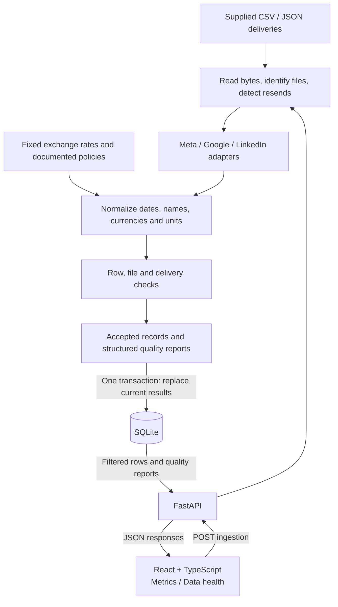
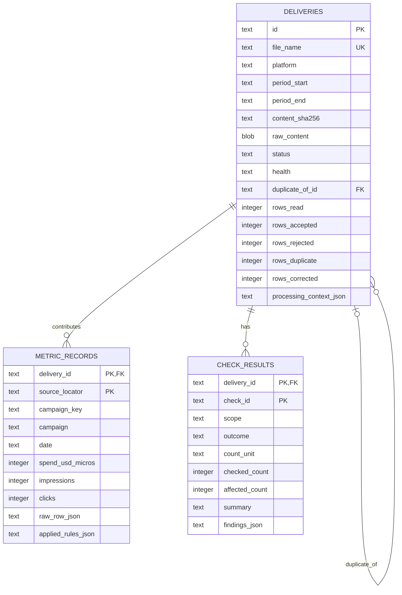

**Campaign Data Hub — implementation plan**

**Status:** Accepted implementation design. See the README for implemented behavior and verification.

**1. Design decision**

Build a small, synchronous batch application using **Python 3.12+, FastAPI, SQLite, and Vite with React/TypeScript**. It will normalize the supplied directory, persist a complete quality report, and expose two connected views: campaign metrics and delivery health.

The design is driven by the README: 15 input files, roughly 31 KB, a single reporting month, repeatable ingestion, error isolation, and explainable numbers. Two days should produce the complete submission; a third day is reserved for verification, setup, and rehearsal.

| Choice | Decision and reason |
|---|---|
| Backend | FastAPI with Pydantic request/response models; the required stack and sufficient validation/documentation |
| Frontend | Vite + React + TypeScript; two views with ordinary React state |
| Storage | SQLite through Python's built-in `sqlite3`; persistent, transactional, and no database server to configure |
| Parsing | Standard-library `csv`, `json`, `datetime`, and `Decimal`; explicit platform rules without dataframe type inference |
| Ingestion | Read and validate each file independently, then publish a complete replacement of current results in one transaction |
| Server-state library | No TanStack Query initially: a few GET requests and one mutation need a small request hook, not a caching layer |
| UI | Semantic tables, native controls, a small shared CSS style sheet, and reusable status/detail components |
| Extensibility | One adapter module per platform and an explicit list of named check functions |
| Traceability | Retain source bytes, parsed source rows, source locators, and transformation details in SQLite |

No Next.js, queue, cloud services, separate raw-file archive, ORM, application framework for plugins, or automatic revision selection. These do not earn their implementation cost for the stated workload. A tidy interface and well-separated modules remain part of the plan.

The full-rebuild choice is deliberate. NFR-1 requires the same outcome without duplicate metrics or quality results; it does not require incremental processing or skipping unchanged files. Rebuilding also refreshes every check when rules change and removes a missing warning when its file arrives. Adding days to the schedule does not create a requirement for import history.

**2. Architecture**



The diagram shows the main flow. Checks also run at the point where their evidence exists: raw duplicate checks precede normalization, unit suspicion is evaluated before a correction hides it, and cadence is evaluated after discovery. A plain `build_snapshot()` function makes this order visible.

There is one backend process, one SQLite database file, and one frontend. Parsing and checks have no FastAPI or database dependencies. The API and a small CLI call the same ingestion function.

**Publication and failure behavior**

1. Validate the configured directory, reporting period, and exchange-rate configuration before attempting publication.
2. Read the input files once into byte buffers. Hash and parse those same bytes.
3. Build delivery reports and normalized records in memory. Expected row and file failures become findings; processing continues with the remaining inputs.
4. Run the remaining delivery/cadence checks and finalize health classifications.
5. Open a transaction, delete the current child and delivery rows, and insert the newly built results. Commit only after every insert succeeds.
6. If persistence fails, roll back and return a failed request. The previously committed results remain available.

An unreadable/missing input directory is a failed run, not permission to clear the database. An existing empty directory is a valid scan with missing-delivery reports. An unreadable individual file becomes a rejected delivery while other files continue. Unexpected internal errors outside a recoverable file/check boundary fail publication rather than silently publishing incomplete work.

Use a connection per request with foreign keys enabled, explicit transaction handling, and parameterized SQL. All reads needed for one API response share one read transaction. A process lock covers ingestion from discovery through commit; a concurrent trigger receives 409. Document single-worker operation. SQLite's [transaction isolation](https://www.sqlite.org/isolation.html) prevents separate connections from observing uncommitted partial writes; Python's [transaction documentation](https://docs.python.org/3.12/library/sqlite3.html#transaction-control) guides connection handling.

**3. Database schema**

Three tables store the current report. A delivery represents one physical file in the configured directory, or one explicit missing platform/week slot. Rejected and duplicate files remain visible even though they contribute no metric rows.



**Identity and relationships**

- Physical entry ID: `file:<filename>`. Missing slot ID: `missing:<platform>:<week-start>`. Discovery uses one configured, non-recursive directory, so filenames identify physical entries in the current snapshot.
- The Google original and resend have different IDs and the same hash. **The content hash is not unique.** The resend references the original using `duplicate_of_id`.
- At most one processed delivery contributes to a platform/week. Different-content files claiming the same slot are marked conflict and excluded; no authoritative version is guessed.
- Missing slots have their own uniqueness constraint, independent of nullable hashes.
- Metric records use delivery ID plus source locator as their primary key. A second constraint prevents two accepted records for one campaign/day within a delivery.
- Check results use delivery ID plus check ID as their primary key. Detailed findings stay in a JSON array because the UI retrieves the whole small report; no independent findings table or pagination is needed.

The following is the planned DDL, included so constraints are concrete and reviewable:

```sql
PRAGMA foreign_keys = ON;

CREATE TABLE deliveries (
    id TEXT PRIMARY KEY NOT NULL,
    file_name TEXT UNIQUE,
    platform TEXT CHECK (platform IN ('meta', 'google', 'linkedin')),
    period_start TEXT,
    period_end TEXT,
    content_sha256 TEXT,
    raw_content BLOB,
    status TEXT NOT NULL CHECK (
        status IN ('processed', 'duplicate', 'rejected', 'conflict', 'missing')
    ),
    health TEXT NOT NULL CHECK (health IN ('pass', 'warn', 'fail')),
    duplicate_of_id TEXT REFERENCES deliveries(id),
    rows_read INTEGER CHECK (rows_read >= 0),
    rows_accepted INTEGER NOT NULL DEFAULT 0 CHECK (rows_accepted >= 0),
    rows_rejected INTEGER NOT NULL DEFAULT 0 CHECK (rows_rejected >= 0),
    rows_duplicate INTEGER NOT NULL DEFAULT 0 CHECK (rows_duplicate >= 0),
    rows_corrected INTEGER NOT NULL DEFAULT 0 CHECK (
        rows_corrected >= 0 AND rows_corrected <= rows_accepted
    ),
    processing_context_json TEXT NOT NULL,
    CHECK (content_sha256 IS NULL OR length(content_sha256) = 64),
    CHECK (
        (status = 'missing' AND file_name IS NULL AND raw_content IS NULL
            AND content_sha256 IS NULL AND platform IS NOT NULL
            AND period_start IS NOT NULL AND period_end IS NOT NULL)
        OR (status <> 'missing' AND file_name IS NOT NULL)
    ),
    CHECK (
        (status = 'duplicate' AND duplicate_of_id IS NOT NULL)
        OR (status <> 'duplicate' AND duplicate_of_id IS NULL)
    ),
    CHECK (duplicate_of_id IS NULL OR duplicate_of_id <> id),
    CHECK (
        status NOT IN ('processed', 'duplicate', 'conflict')
        OR (platform IS NOT NULL AND period_start IS NOT NULL
            AND period_end IS NOT NULL)
    ),
    CHECK (status = 'processed' OR rows_accepted = 0)
);

CREATE UNIQUE INDEX one_processed_delivery_per_slot
    ON deliveries(platform, period_start) WHERE status = 'processed';
CREATE UNIQUE INDEX one_missing_delivery_per_slot
    ON deliveries(platform, period_start) WHERE status = 'missing';
CREATE INDEX deliveries_platform_period ON deliveries(platform, period_start);

CREATE TABLE metric_records (
    delivery_id TEXT NOT NULL REFERENCES deliveries(id) ON DELETE CASCADE,
    source_locator TEXT NOT NULL,
    campaign_key TEXT NOT NULL,
    campaign TEXT NOT NULL,
    date TEXT NOT NULL,
    spend_usd_micros INTEGER CHECK (spend_usd_micros >= 0),
    impressions INTEGER CHECK (impressions >= 0),
    clicks INTEGER CHECK (clicks >= 0),
    raw_row_json TEXT NOT NULL,
    applied_rules_json TEXT NOT NULL,
    PRIMARY KEY (delivery_id, source_locator),
    UNIQUE (delivery_id, campaign_key, date),
    CHECK (clicks IS NULL OR impressions IS NULL OR clicks <= impressions)
);
CREATE INDEX metric_records_date ON metric_records(date);

CREATE TABLE check_results (
    delivery_id TEXT NOT NULL REFERENCES deliveries(id) ON DELETE CASCADE,
    check_id TEXT NOT NULL,
    scope TEXT NOT NULL CHECK (scope IN ('row', 'file', 'delivery')),
    outcome TEXT NOT NULL CHECK (
        outcome IN ('pass', 'warn', 'fail', 'skipped', 'error')
    ),
    count_unit TEXT NOT NULL CHECK (
        count_unit IN ('row', 'file', 'cell', 'delivery')
    ),
    checked_count INTEGER CHECK (checked_count >= 0),
    affected_count INTEGER CHECK (affected_count >= 0),
    summary TEXT NOT NULL,
    findings_json TEXT NOT NULL,
    PRIMARY KEY (delivery_id, check_id),
    CHECK (affected_count <= checked_count)
);
```

Dates are ISO strings, validated as real calendar dates in Python. Nullable integers distinguish unknown metrics from measured zero. Python additionally rejects non-integral counts, non-finite amounts, and integers outside the storage range; SQLite affinity alone does not provide those validations. JSON fields are validated and serialized by the application. No JSON database querying is needed.

`rows_read` is null when a file could not be parsed or a duplicate was not parsed separately. For a completely parsed processed file, `rows_read = rows_accepted + rows_rejected + rows_duplicate`. `rows_corrected` is a subset of accepted rows with the explicit spend-unit repair, not a count of routine formatting/currency conversions.

`processing_context_json` records the pipeline policy version, reporting configuration, exchange-rate values used, correction configuration, and a dataset fingerprint. The fingerprint is computed deterministically from sorted filenames/content hashes and processing configuration. It supports detecting a stale source-detail request after the dataset changes. This small context is repeated per delivery to keep each delivery report self-describing.

`raw_content` preserves the actual bytes processed, including a file that could not be parsed. It is excluded from ordinary API responses. The entire source corpus is roughly 31 KB, so retaining it in the same database is straightforward. `raw_row_json` preserves parsed original values and absent keys; source locators connect them to exact file bytes. Rejected rows remain available through findings and those bytes.

Insertion order is ordinary/rejected/conflict/missing deliveries first, duplicate references second, then metric rows and check results. Delete child tables before deleting all deliveries. Enable [SQLite foreign keys](https://www.sqlite.org/foreignkeys.html) on every connection before transactions begin. Application validation also verifies that only processed deliveries receive metric rows and that a missing slot does not coexist with a received file for that slot.

**4. Ingestion behavior and data policies**

The directory is the source of truth for the current report. A successful new ingestion replaces previous results and their stored raw content. Removing a file removes its old contribution and creates a missing warning where applicable. Changing a file in place replaces that physical entry's current report. This version does not retain historical revisions or a last-known-good copy alongside current data.

| Situation | Selected behavior |
|---|---|
| Same directory and rules ingested again | Recompute and replace; metric rows, check outcomes, finding content, and deterministic IDs remain identical |
| Byte-identical resend in the same platform/week | Keep both file entries; one contributes records, the other is duplicate/WARN with a link to the original |
| Multiple different contents for the same platform/week | Mark all entries in that slot conflict/FAIL; contribute no metrics from that slot |
| Broken received file | Rejected/FAIL; it is received and broken, not also a missing delivery |
| No file for an expected platform/week | Persist one synthetic missing/FAIL entry |
| Unknown non-hidden input filename or incompatible extension | Persist a rejected entry and filename/schema findings; do not silently ignore it |
| Hidden files and directories | Ignore during non-recursive discovery |
| Exact duplicate rows | Detect before lossy normalization; keep the first source occurrence and report all duplicate locators |
| Rows differing only in accepted name/date formatting, with equal metric values | Treat as equivalent duplicates; keep the first source occurrence and report the others |
| Same normalized campaign/date with conflicting source metrics | Reject all conflicting rows with evidence; do not choose one arbitrarily |
| Invalid campaign identity/date or date outside its declared week | Reject that row and continue |
| Missing metric value | Retain the row, store the field as null, report WARN |
| Invalid metric value, unsupported currency, negative spend/counts | Null the affected field, retain other valid fields, report FAIL |
| Clicks exceed known impressions | Null clicks under a documented range policy; retain impressions and report FAIL |
| Unrecoverably malformed CSV/JSON serialization | Reject the file; continue with other files |
| An individual check crashes | Persist an error outcome and FAIL health; continue other checks; quarantine the affected file if identity, deduplication, or required normalization could not be verified |

Filename parsing validates the platform, extension, real week-start date, Monday anchor, and reporting period. The 06-29 week is explicitly clipped to 06-30. Suffixes such as `_resend` are recognized without treating their spelling as proof of content equality. Among equal-content candidates, prefer an unsuffixed name, then lexical order. Directory listing order and modification time do not decide results.

Each adapter owns its header/key mapping and date/unit semantics. Missing required CSV columns reject the file; additional columns can be preserved and reported without failing it. JSON must be an array, and invalid individual items produce row findings. LinkedIn's optional `clicks` key is accepted as absent. Recoverable row-validation errors are caught inside the row loop.

Campaign identity is `(platform, trim(name).casefold())`. Choose the most common trimmed original spelling as the display label, with lexical tie-breaking. Count each distinct accepted observation once when selecting that label. Campaign IDs are unavailable; document name normalization as a dataset assumption.

Determine equivalent/conflicting duplicates before invalid source values are replaced with null. Two different invalid amounts becoming null does not make those rows equivalent. If metric equality cannot be established, report a conflict. The duplicate-row count includes extra exact and equivalent copies; only exact copies occur in the supplied data.

Money is parsed from strings using Decimal; FX rates are loaded as Decimal. Store integer millionths of USD, preserving the supplied sub-cent Google value and EUR conversions exactly. If a future amount cannot be represented exactly at the chosen precision, null it and report a precision error rather than silently truncate. Derived ratios may be JSON numbers; source and aggregate money remain exact integers/decimal strings. Use HALF_UP for display rounding.

**Explicit Meta unit correction**

The 06-08 Meta file strongly suggests cents labelled as dollars. This is a documented interpretation, not an externally confirmed fact. Put the reviewed correction in `config/normalization_overrides.json`, keyed by the full content hash, with platform, divisor `100`, rule ID, and reason. The known hash is:

`a243f68f8b66f4cbd2149159ced14eaae67976be19c0a7755f45828e55d22ed8`

The adapter applies the correction only to this matching content. Every affected record retains its raw spend and an applied-rule entry containing the divisor and before/after amounts. The delivery remains FAIL because the source contract was violated.

Separately, a general Meta spend check examines raw values across the current batch: at least ten usable rows, integer-valued spend throughout, and a median raw spend ratio in the range 50–200 against other distinct Meta deliveries with a positive usable baseline. This signals a possible unit mismatch; it never authorizes an automatic correction. With no positive usable baseline, record that the comparative check is skipped. Ordinary whole-dollar files without that scale anomaly remain unchanged. A suspicious file without a matching documented correction has its spend nulled and a FAIL finding; valid impressions/clicks may still contribute.

The correction is data-specific configuration, not an expected-total constant hidden in the parser. A changed file does not inherit it from the filename. Its scope and uncertainty will be visible in the README and delivery details.

**5. Quality-check contract**

Each named check returns a `CheckResult`: ID, scope, outcome, checked/affected counts, count unit, summary, and a list of findings. A finding contains severity, source locator where available, field, observed value, expected condition, message, and optional supporting metadata. Checks are ordinary functions in an explicit list; adding a check requires a function, a list entry, and a meaningful test.

Successful checks are persisted too. Skipped checks include their reason. File/slot checks count files or deliveries; duplicate-row checks count extra copies; completeness checks count campaign/day cells. Do not label every affected count as a number of rows.

| Check | Outcome policy and supplied-data expectation |
|---|---|
| Filename/schema/parse | FAIL for unusable input; supplied files parse successfully |
| Duplicate delivery | WARN; Google 06-15 resend contributes zero rows |
| Conflicting deliveries | FAIL; none in supplied inputs |
| Date validity/window | FAIL and reject row; one impossible Meta date |
| Date-format variation | WARN while accepting valid date; one ISO Meta row |
| Required metrics | WARN for missing values; eight rows have unknown clicks |
| Metric range and supported currency | FAIL for invalid values; one negative spend becomes null |
| Campaign normalization | Informational evidence for three case and three whitespace variants |
| Exact duplicate rows | WARN; eight extra Google rows removed |
| Conflicting campaign/day rows | FAIL and reject conflicting rows; none supplied |
| Campaign/day completeness | WARN for absent cells within the declared week; one missing valid App Install Push day |
| Spend-unit suspicion/correction | FAIL with evidence; 35 Meta rows have the documented repair |
| Impressions volume | WARN outside 0.5–2 times the median impressions/day of at least two other usable same-platform weeks; none expected here |
| Delivery cadence | FAIL for absent expected slots; LinkedIn 06-22 missing |
| Reporting-period boundary | PASS/info for correctly clipped two-day final week |
| Sub-cent spend | PASS/info; preserved precision is valid |

Cross-delivery comparisons use the complete current batch with resends/conflicts excluded, so they are independent of discovery order. Completeness assumes a campaign observed in a delivery was expected on every day of that delivery's clipped week. There is no external campaign roster, so we will not claim to detect an entirely absent campaign from that file alone.

Health is FAIL if any check is fail/error, WARN if any is warn, and PASS otherwise. Informational findings do not change health. Status describes whether/how a file was processed; health describes its quality. A processed/FAIL file may contribute its valid rows and fields. The UI exposes that distinction.

**6. Metrics, missing data, and traceability**

SQL selects accepted rows through processed deliveries using platform and inclusive record-date filters. A single readable Python aggregation helper groups those rows by campaign or platform and computes totals from that same filtered set. At 368 records, this keeps ratio and lineage logic in one place without needing complex SQL. The browser never recomputes business totals.

- Sum known money/counts. For a nonempty group with an entirely unknown metric, return null. For an empty result, return zero summary counts/spend and null ratios.
- CTR is the sum of clicks divided by the sum of impressions over rows where both are known.
- CPC is the sum of spend divided by the sum of clicks over rows where both are known.
- Rows with zero clicks stay in the eligible CPC set. A zero summed denominator produces null. Never average daily CTR/CPC values.
- Return the eligible numerator, denominator, row count, and missing-field counts with each ratio. The UI labels the basis so a ratio's difference from the headline column totals is explainable.
- Return contributing delivery IDs with each group/total, and show missing/conflict/rejected slots relevant to the active platform/date filters as caveats. Missing deliveries have no rows and therefore cannot be discovered solely from the contributing records.

This paired-ratio policy is a defensible choice for incomplete fields, not an explicitly mandated interpretation in the README. It will be documented prominently and used consistently. No alternative-policy toggle is required.

For each record, `applied_rules_json` is a list of short objects, for example:

```json
[
  {"id": "google.micros_to_usd", "source_unit": "micros"},
  {"id": "currency.to_usd", "currency": "USD", "rate": "1.0"}
]
```

The source-details flow is: selected UI total/group → matching API filters → contributing records → delivery filename/hash and source locator → original values and applied rules. A record such as Google's `64629999` can be shown as exactly `64.629999` USD with a two-decimal display of `64.63`.

Every successful data response includes `dataset_fingerprint` from the saved processing context. Source-detail requests carry it as `expected_fingerprint`; a mismatch returns 409 with a refresh message so a number from an old snapshot is not explained using new rows. Before the first ingestion, the fingerprint is null and the UI shows an ingestion empty state.

**7. API contract**

| Method and path | Behavior |
|---|---|
| `POST /api/ingestion` | Synchronously rebuild current results; 200 with file/record counts and health totals after commit |
| `GET /api/metrics` | `group_by=campaign` or `platform`; optional `platform`, `start_date`, `end_date`; returns items, totals, caveats, and dataset fingerprint |
| `GET /api/records` | Same platform/date filters plus optional `campaign_key` and `delivery_id`; returns normalized rows, original fields, rules, and source locators; accepts expected dataset fingerprint |
| `GET /api/deliveries` | All physical files and missing slots; optional platform/health filters; includes metadata and status/health counts |
| `GET /api/deliveries/{id}` | Full metadata and ordered check results/findings; accepts expected dataset fingerprint |
| `GET /api/health` | Small process/database liveness response for setup and smoke checks |

Platform grouping is supported by the API even though the primary table groups by campaign. Campaign drill-down always includes platform because campaign keys are only unique within a platform. Detail responses omit raw file bytes, while retaining enough row values to explain transformations.

Use one platform or all in the initial UI. Dates are inclusive ISO calendar dates; `start_date > end_date`, invalid dates, unknown platforms, and unsupported grouping values return 422. Valid dates outside the supplied month return matching rows if any, otherwise an empty result; cadence warnings concern only the configured reporting period. Unknown delivery returns 404. Concurrent ingestion or a stale detail request returns 409 with a specific reason. A failed configuration/publication returns 500; individual delivery defects are successful ingestion results with visible failed health.

Money fields: `spend_usd_micros` is the exact integer, `spend_usd` is an exact decimal string, and `spend_usd_display` is the two-decimal string produced after aggregation. Return CTR as a fraction (the UI formats it as a percentage), CPC as a ratio number, and exact ratio bases. For this corpus, micro-USD values fit JavaScript's safe-integer range; sorting uses those values, never formatted currency text. Display CPC to four decimals and CTR to two percentage decimals.

One metrics response contains the table and totals together. No separate totals request or frontend arithmetic can race with it. Errors use FastAPI's ordinary `detail` response convention with explicit messages. Typed response models document shapes in OpenAPI; no custom error framework or generated client is necessary.

Ingestion summary counts distinguish physical files, processed files, duplicate files, rejected/conflict files, missing slots, accepted/rejected rows, extra duplicate rows, and repaired rows. The second identical run reports processing again, rather than claiming all files were skipped.

**8. Frontend behavior**

`App` owns the selected view, filters, and a refresh counter. Metrics and Data health are two labelled tabs in a simple application shell. Selected filters survive switching views. A single ingestion button is disabled while its request is active.

| View | Required behavior |
|---|---|
| Metrics | Platform/date filters; totals; campaign table; spend/CTR sorting with nulls last; incomplete-data/correction caveat; source-details panel for a group or total |
| Data health | Platform/week matrix plus file entries so the resend remains visible; status/health text; selectable detail panel with every check, counts, and expandable evidence |
| Shared | Clear loading, empty, error, and refresh states; keyboard-operable controls; readable number alignment and consistent spacing |

Use native selects/date inputs and semantic HTML tables. Status color is accompanied by text. Platform labels are always visible; decorative logos are deferred. Native `details` elements or an inline side panel can show evidence without a modal framework. Keep styling coherent and restrained; visual polish is not an evaluation criterion.

`api.ts` contains typed request functions. One small `useApi` hook handles GET loading/error/data state, aborts obsolete requests, and ignores stale completions. It does not become a custom cache. The ingestion POST runs in the click handler, not a mount effect. After success, clear stale selections and refresh metrics/health with the same filters. A stale-detail 409 triggers a visible refresh action. React documents the need for cleanup when [fetching in Effects](https://react.dev/learn/you-might-not-need-an-effect#fetching-data).

Use Vite's `/api` development proxy to reach FastAPI and keep browser requests relative. For a production build, FastAPI can serve the compiled frontend; `/api` routes remain separate. This permits an optional single-service Docker image without requiring a Node server at runtime.

**9. Code structure and implementation boundaries**

```text
backend/
  pyproject.toml
  app/
    main.py                    # App construction, API routes, static build serving
    schemas.py                 # Pydantic API models
    config.py                  # Paths, reporting period, thresholds, policy version
    domain.py                  # Small Row / Finding / CheckResult / DeliveryResult types
    database.py                # Connection setup, filtered reads, snapshot replacement
    schema.sql                 # The three tables and constraints
    ingestion.py               # Discovery, orchestration, deduplication, publication
    normalization.py           # Explicit date, count, money and name helpers
    metrics.py                 # Shared grouping, sums, ratio bases and lineage
    adapters/
      __init__.py              # Explicit platform-to-parser mapping
      meta.py
      google.py
      linkedin.py
    checks.py                  # Named check functions and explicit registry
    cli.py                     # Calls the same ingestion function as the API
  tests/
    conftest.py
    test_normalization.py
    test_checks.py
    test_ingestion.py
    test_api.py
frontend/
  src/
    App.tsx
    api.ts
    types.ts
    hooks/useApi.ts
    views/MetricsView.tsx
    views/HealthView.tsx
    components/FilterBar.tsx
    components/StatusBadge.tsx
    components/SourceDetails.tsx
    styles.css
config/
  normalization_overrides.json
data/                          # Supplied inputs remain unchanged
docs/
  IMPLEMENTATION_PLAN.md
  DATA_QUALITY.md
var/                           # Generated database, ignored by Git
README.md
```

Functions should have a visible purpose; use small dataclasses for domain results and Pydantic at the API boundary. Share concrete parsing/normalization helpers rather than introducing abstract base classes. A new platform requires an adapter and registry/config entry; a new validation requires a check and test. Split a large module when it becomes difficult to navigate, not preemptively into a framework.

Runtime dependencies: FastAPI, Uvicorn, and Pydantic on the backend; React and React DOM on the frontend. Build/development dependencies include Vite, TypeScript, ESLint, pytest, and httpx for API tests. Use Ruff for Python linting. Select compatible stable versions during scaffolding and commit reproducible dependency locks. Python 3.12+ is explicit in setup; do not rely on the machine's default interpreter.

**10. Acceptance criteria and meaningful tests**

These are verified expectations for the selected cleaning policy, not a claim about the interviewer's undisclosed answer key:

| Measure | Expected |
|---|---:|
| Physical files / report entries including missing | 15 / 16 |
| Accepted rows / campaigns | 368 / 13 |
| Exact spend, micro-USD | 54,277,299,999 |
| Displayed spend | $54,277.30 |
| Impressions / known clicks | 16,385,560 / 346,988 |
| Rows with unknown clicks / spend | 8 / 1 |
| Rejected invalid-date rows / extra exact row copies | 1 / 8 |
| Explicitly repaired rows | 35 |
| Overall paired CTR | 346,988 / 16,177,923 = 2.144824…% |
| Overall paired CPC | $53,509.722799 / 346,563 = $0.154401… |
| Expected health distribution | 8 PASS / 4 WARN / 4 FAIL |

Per-platform exact spend assertions: Google `27_954_499_999`, Meta `20_036_390_000`, LinkedIn `6_286_410_000` micro-USD. Protect the corrected Summer Sale paired CPC `$0.142491…` as well as the overall totals.

| Test group | Failure it should expose |
|---|---|
| Real-input regression | Wrong conversions, double counting, inconsistent totals, missed defects |
| Repeat ingestion | Any change to normalized rows, deterministic IDs, quality outcomes, or finding content with identical inputs/rules |
| Duplicate/schema constraints | Resend must be storable while contributing nothing; repeated missing slots and duplicate accepted campaign/day keys must be prevented |
| Row/file isolation | A bad row between valid rows must not lose its neighbors; a malformed file must not stop other files |
| Publication rollback | Inject a persistence failure after deletion starts; old rows and reports must survive |
| Rule boundaries | Legitimate whole-dollar files remain unchanged; reviewed content gets the correction; changed bytes do not inherit it |
| Missing/conflicting slots | A late delivery removes the missing entry; conflicting versions are excluded; the final two-day week stays valid |
| Precision/date/null examples | Preserve 64,629,999 micros and EUR precision; UTC date conversion; invalid date; zero/unknown denominators; all-unknown metrics |
| Check extensibility | A small new check runs and persists pass/failure details without changing orchestration; a crashed check makes health FAIL |
| API contracts | Both groupings, inclusive filters, same-set totals, empty results, 404/409/422, and exact source drill-down |

Tests use temporary databases and input directories. Expected numeric values come from the independent investigation, not production helpers. Do not copy a normalized fixture into the implementation or hardcode expected totals there.

Manually exercise the actual browser: ingest twice, change filters quickly, sort spend/CTR, inspect every failed/warning delivery, trace a corrected and a sub-cent amount, and verify post-ingestion refresh. Run the TypeScript build and Python/API suite. Add a focused browser automation test only if it exposes a remaining interaction risk; do not build a large frontend test harness.

**11. Ordered implementation schedule**

| Phase | Approximate effort | Deliverable and gate |
|---|---:|---|
| 1. Scaffold and contracts | 1 h | Backend/frontend start, domain types and response models agreed, schema created in a temporary DB |
| 2. Adapters and normalization | 2–3 h | Every platform parsed; precision/date/null examples pass; raw provenance retained |
| 3. Checks and complete snapshot | 2–3 h | Defects reported with evidence; selected policy reproduces exact totals in memory |
| 4. Persistence and ingestion API | 1–2 h | Atomic replacement, second-run equality, file isolation, and rollback verified |
| 5. Metrics and health API | 1–2 h | Both grouping modes, filters, ratio bases, caveats, and traceability work |
| 6. Two frontend views | 3–4 h | Full requirements visible and interactive; loading/errors/refresh behavior work |
| 7. Integration and clean setup | 2 h | Real browser verification; README alone reproduces setup and ingestion |
| 8. Submission and rehearsal | 2 h | Matching diagram, decisions/findings/deferred work documented; explain and modify one check |

Target two focused working days for the complete application. The third day is buffer and hardening: resolve failures first, then add CI for backend tests/lint and frontend typecheck/build, and an optional Dockerfile/Compose command after the non-Docker setup is verified. Lockfiles and clean setup belong to the core submission, not polish.

At each phase, review the small completed change and explain its main function, inputs, outputs, and failure behavior before moving on. LLM assistance should help implement and review each layer; the final code must remain understandable without the conversation.

**12. Requirement coverage and deliberate limits**

| Requirement | Where it is satisfied |
|---|---|
| FR-1 | Platform adapters, normalization helpers, canonical metric table |
| FR-2 / FR-3 | Persisted check results/findings and explicit health roll-up |
| FR-4 | Filtered metrics endpoint with campaign/platform grouping and totals |
| FR-5 | Delivery list and complete delivery quality report |
| FR-6 | Synchronous ingestion POST calling shared orchestration |
| FR-7 | Metrics view with filters, spend/CTR sorting, and server totals |
| FR-8 | Scannable health matrix/file list and check evidence detail |
| NFR-1 | Deterministic full replacement, database constraints, repeat-ingestion comparison |
| NFR-2 | Row/file/check boundaries and atomic publication rollback |
| NFR-3 | Stored source bytes/rows, locators, rule metadata, ratio bases, and UI drill-down |

Deferred: revision/run history, individual-delivery import endpoints, automatic supersession, background jobs, scheduled imports, uploads, authentication, cloud storage, evolving FX rates, campaign master data, distributed concurrency, large-result pagination, advanced charts, and UI customization screens.

The reason for these limits is the supplied workload and assessment scope. The production extension points are ordinary boundaries already present: adapter functions, check functions, snapshot construction, persistence, and the API. The interview explanation should start with these concrete behaviors and demonstrate a real source-to-number trace.

**Design verification completed:** The DDL above was executed against an in-memory SQLite database. Eleven checks covered storing an original/resend with equal hashes, processed-slot and missing-slot uniqueness, foreign-key enforcement, exact micro-USD/null storage, campaign/day uniqueness, metric constraints, check-result uniqueness, rollback, and full replacement with duplicate references. The proposed impressions-volume thresholds were also compared against the independently verified supplied-week totals and introduce no extra warnings. These checks validate the schema proposal; application behavior will be tested during implementation.
